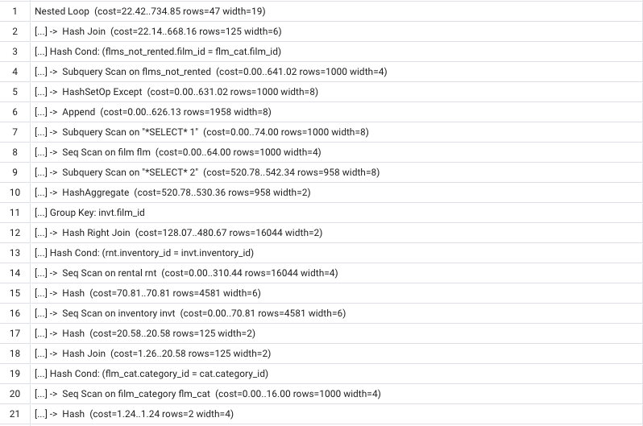
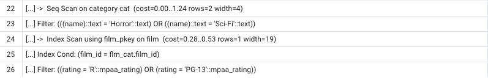
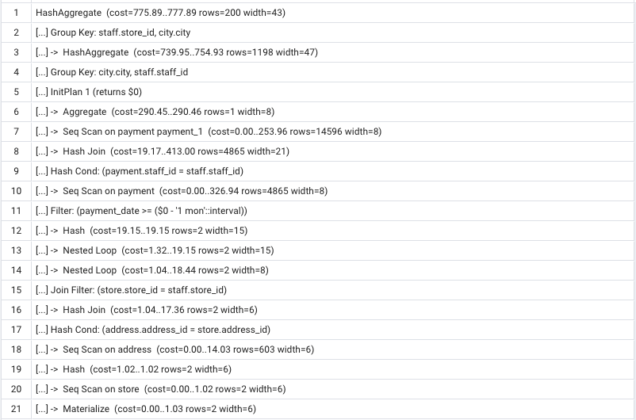
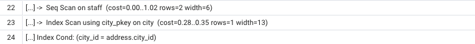

a.chernitsa@innopolis.university  

See any information about exercises inside the sql files.

For exercise 2:  

The most expensive queries are JOINS, AGGREGATES and APPENDS;  
We can make some indexes for fields that costs a lot, but e.g. SUM or MAX we can't optimize using it.  

Explain of first subtask:  

Explain of second subtask:  

