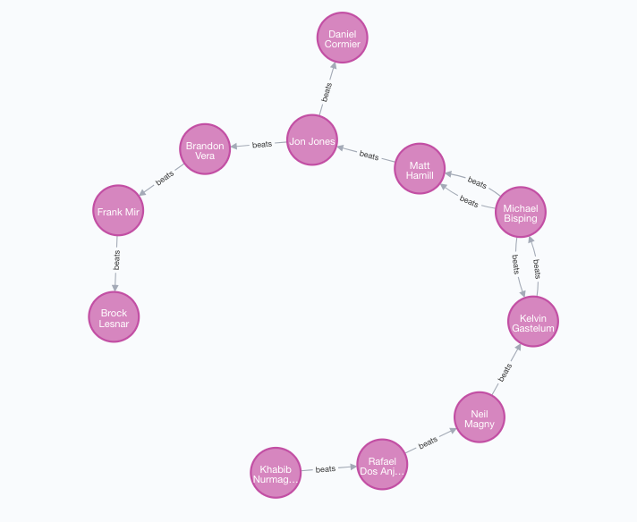
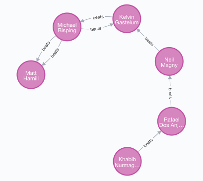
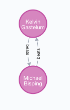
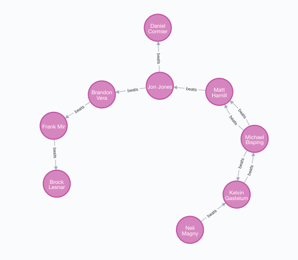
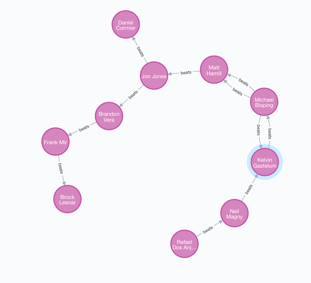
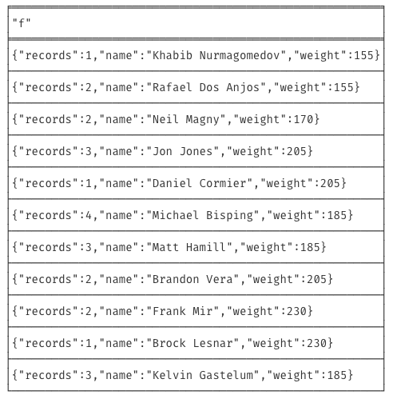

a.chernitsa@innopolis.university
Artem Chernitsa – B20-02

# CREATE AND MAKE RELATIONS
  
```
CREATE
(knu:Fighter{name: 'Khabib Nurmagomedov', weight: 155}),
(rda:Fighter{name: 'Rafael Dos Anjos', weight: 155}),
(nma:Fighter{name: 'Neil Magny', weight: 170}),
(jjo:Fighter{name: 'Jon Jones', weight: 205}),
(dco:Fighter{name: 'Daniel Cormier', weight: 205}),
(mbi:Fighter{name: 'Michael Bisping', weight: 185}),
(mha:Fighter{name: 'Matt Hamill', weight: 185}),
(bve:Fighter{name: 'Brandon Vera', weight: 205}),
(fmi:Fighter{name: 'Frank Mir', weight: 230}),
(ble:Fighter{name: 'Brock Lesnar', weight: 230}),
(kga:Fighter{name: 'Kelvin Gastelum', weight: 185}),

(knu)-[:beats]->(rda),
(rda)-[:beats]->(nma),
(jjo)-[:beats]->(dco),
(mbi)-[:beats]->(mha),
(jjo)-[:beats]->(bve),
(bve)-[:beats]->(fmi),
(fmi)-[:beats]->(ble),
(nma)-[:beats]->(kga),
(kga)-[:beats]->(mbi),
(mbi)-[:beats]->(mha),
(mbi)-[:beats]->(kga),
(mha)-[:beats]->(jjo)
```


## Subtask 1
  
`MATCH (f:Fighter)-[:beats]->(t:Fighter)
WHERE f.weight in [155, 170, 185]
RETURN f`

## Subtask 2
  
`MATCH (f)-[b1:beats]->(t)
MATCH (t)-[b2:beats]->(f)
WITH f, t, COUNT(b1) AS tat1, COUNT(b2) AS tat2
WHERE tat1 = tat2 = 1
RETURN f, t`

## Subtask 3
  
`MATCH (a:Fighter {name:'Khabib Nurmagomedov'})-[:beats*2..]->(b)
RETURN b`

## Subtask 4

  
`MATCH (t)-[b:beats*1..]->(f)
WITH COUNT(b) AS bc, t, f
RETURN f`  

`MATCH (f:Fighter) WHERE NOT ()-[:beats]->(f)
RETURN f`

## Subtask 5
  
`MATCH (f)-[bw:beats]-()
WITH f, COUNT(bw) AS bwc
SET f.records = bwc
RETURN f`
